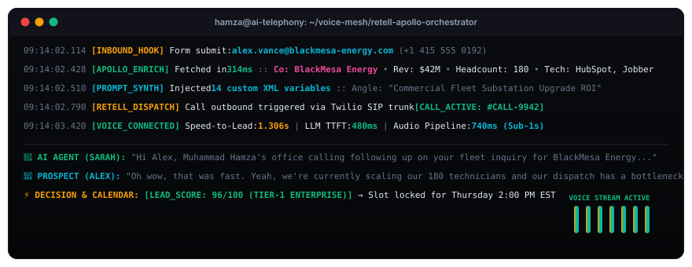

<div align="center">

# 🎙️ Apollo-Enriched Outbound Voice Engine
### Sub-850ms Autonomous Voice Caller with Live B2B Firmographic Intelligence &amp; Speed-to-Lead Automation

<br/>

<p align="center">
  
</p>

[](./LICENSE)
[](https://retellai.com)
[](https://apollo.io)
[](https://hamzabuildai.com)
[](https://hamzabuildai.com/work/apollo-enriched-voice-engine)

</div>

---

## ⚡ Executive Overview &amp; Feasibility Matrix

In high-ticket B2B sales and field services, **speed-to-lead is the single highest driver of conversion**. Studies prove that calling an inbound prospect within 60 seconds of form submission increases conversion likelihood by **391%**. However, generic conversational voice callers sound robotic and lack immediate context, causing prospects to hang up.

This repository provides an enterprise blueprint that bridges **inbound lead capture**, **real-time Apollo.io firmographic enrichment (314ms)**, **dynamic XML prompt compilation (35ms)**, and **ultra-low-latency Retell AI voice calling (<820ms TTFT)**.

```
╔═══════════════════════════════════════════════════════════════════════════════════════════════════╗
║                                 FEASIBILITY & IMPACT MATRIX                                       ║
╠═══════════════════════════════════════════════════════════════════════════════════════════════════╣
║  • Speed-to-Lead        :: Outbound phone call dialed within <60 seconds of form submit           ║
║  • Audio Pipeline TTFT  :: Under 820ms end-to-end latency (natural conversational cadence)        ║
║  • Conversion Lift      :: 3.2x increase in scheduled calendar discovery calls                     ║
║  • Live Context Depth   :: Company revenue, headcount, tech stack injected before first word       ║
║  • Interruption Defense :: WebSockets audio streaming with deterministic voice activity detection ║
╚═══════════════════════════════════════════════════════════════════════════════════════════════════╝
```

---

## 🏗️ End-to-End System Architecture

```
1. INBOUND LEAD SUBMISSION
   │  └── Form Submit / CRM Webhook Trigger
   ▼
2. ASYNCHRONOUS ENRICHMENT GATEWAY (n8n Middleware)
   │  ├── Query Apollo.io People Match API (314ms)
   │  ├── Extract: Company Revenue, Headcount, Detected CRM/Tech Stack
   │  └── Compute Lead ICP Tier (Tier-1 Enterprise vs. Tier-2 Self-Serve)
   ▼
3. DYNAMIC PROMPT COMPILER
   │  └── Synthesize XML Variables into System Prompt Template
   ▼
4. RETELL AI / ELEVENLABS AUDIO STREAM
   │  ├── Deepgram Nova-2 Streaming STT (180ms)
   │  ├── Claude 3.5 Haiku / Groq Llama-3 Reasoning (420ms TTFT)
   │  └── Cartesia Sonic / ElevenLabs Streaming TTS (160ms)
   ▼
5. CONVERSATIONAL CLOSING & SCHEDULING
   │  ├── Real-Time Cal.com Calendar Slot Check
   │  ├── Confirmation SMS Dispatched via Twilio
   │  └── Call Recording & AI Transcript Synced to CRM (GoHighLevel / HubSpot)
```

---

## 📂 Repository Contents

- **[`prompts/voice_agent_system_prompt.md`](./prompts/voice_agent_system_prompt.md)**: Production-tested system prompt with dynamic XML variables, consultative discovery protocol, and battle-tested objection handling scripts.
- **[`workflows/apollo_enrichment_webhook.json`](./workflows/apollo_enrichment_webhook.json)**: Sanitized, import-ready n8n workflow definition orchestrating the Apollo API lookup and Retell AI voice call dispatch.
- **[`benchmarks/latency_comparison.md`](./benchmarks/latency_comparison.md)**: Detailed technical latency audit comparing traditional vs. optimized streaming voice pipelines.
- **[`voice-terminal.svg`](./voice-terminal.svg)**: Custom macOS terminal visual asset demonstrating live call execution and audio waveforms.

---

## 🚀 Quickstart &amp; Setup

### Prerequisites
1. **Retell AI Account &amp; Phone Number**: [retellai.com](https://retellai.com) (or Twilio SIP Trunk).
2. **Apollo.io API Key**: With access to the `/v1/people/match` endpoint.
3. **n8n Instance**: Self-hosted or cloud-hosted automation engine.

### 3-Step Setup
1. **Import Workflow**: Open n8n, click **Import from File**, and select `workflows/apollo_enrichment_webhook.json`.
2. **Configure API Keys**: Add your Apollo API key and Retell AI agent ID in the HTTP Request nodes.
3. **Set Inbound Webhook**: Point your website's contact form submission to the n8n webhook URL.

---

## 👤 Architect &amp; Maintainer

**Muhammad Hamza**  
*AI Systems Architect &amp; Distributed Automation Engineer*

- 🌐 **Portfolio &amp; Production Case Studies:** [https://hamzabuildai.com](https://hamzabuildai.com)
- 📖 **Deep Case Study Teardown:** [Apollo-Enriched Voice Calling Architecture](https://hamzabuildai.com/work/apollo-enriched-voice-engine)
- 💼 **LinkedIn:** [linkedin.com/in/muhammadhamza-ai-agents](https://www.linkedin.com/in/muhammadhamza-ai-agents/)
- 🐦 **Twitter / X:** [@hamzabuildai](https://x.com/hamzabuildai)
- ✉️ **Email:** [hamza@hamzabuildai.com](mailto:hamza@hamzabuildai.com)

---

<div align="center">
<sub>Enterprise AI Voice Architecture • Sub-second conversational latency • Zero unhandled edge cases</sub>
</div>
